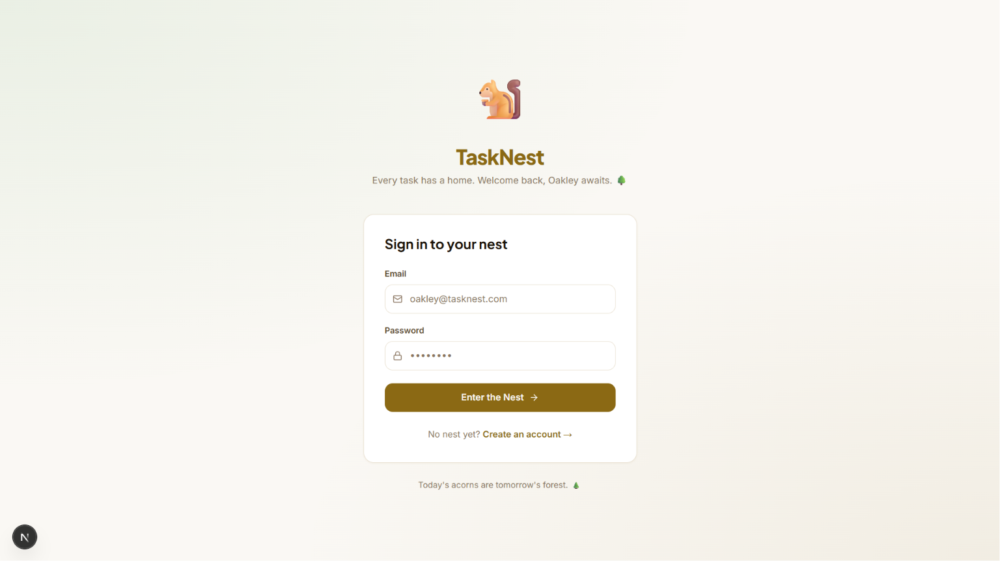
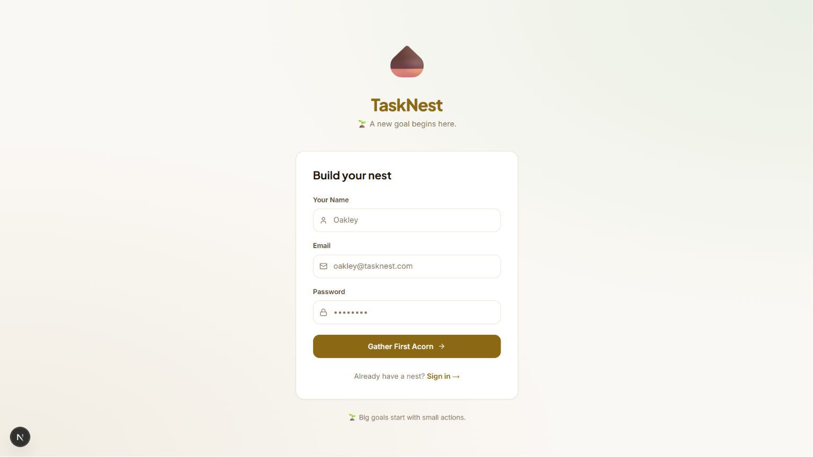
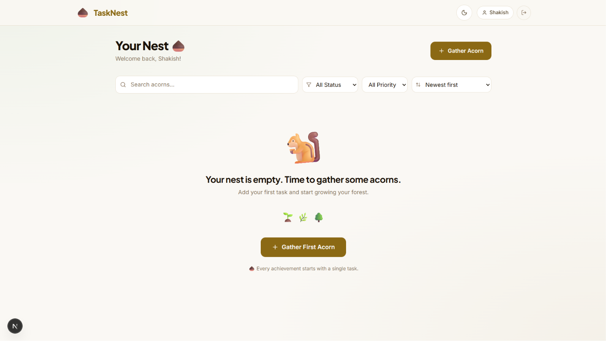
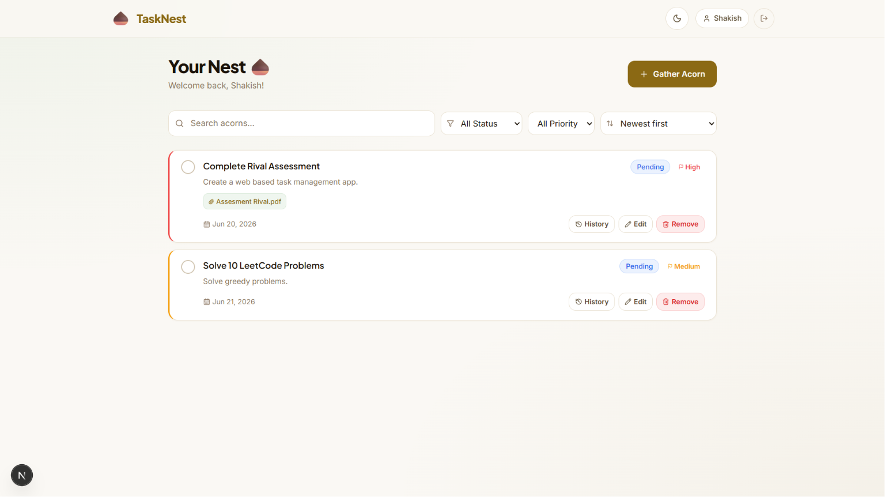
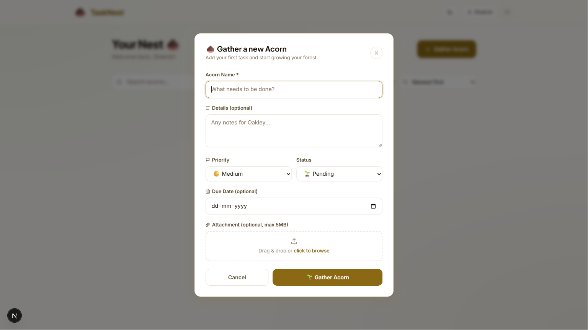
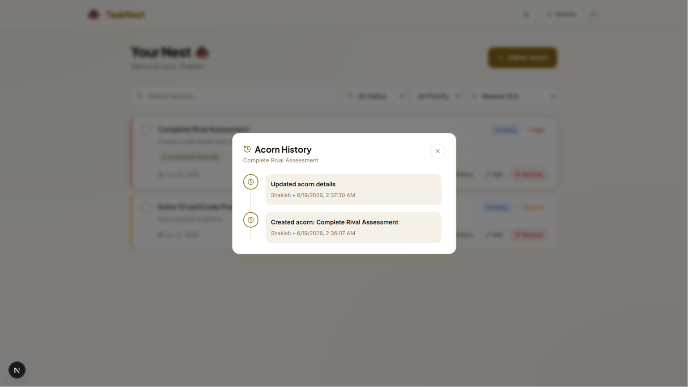
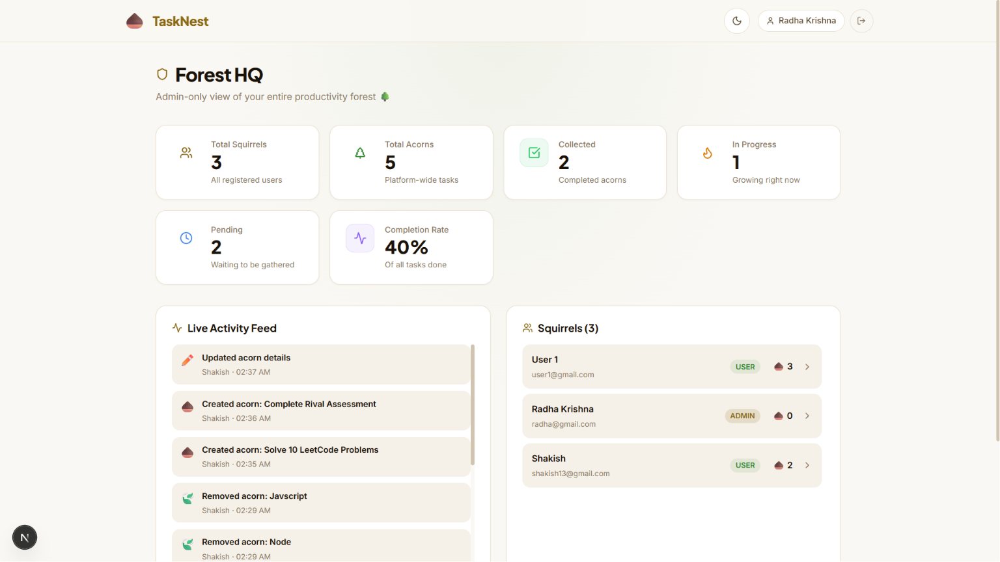
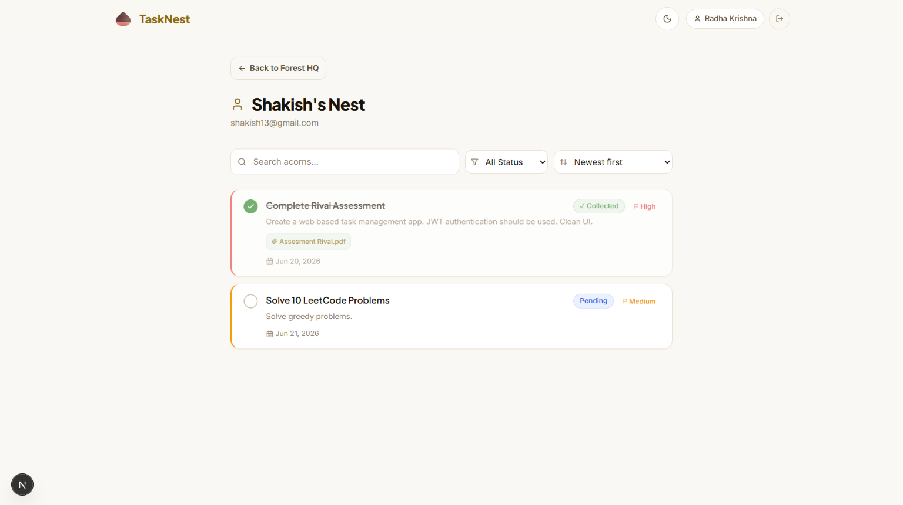
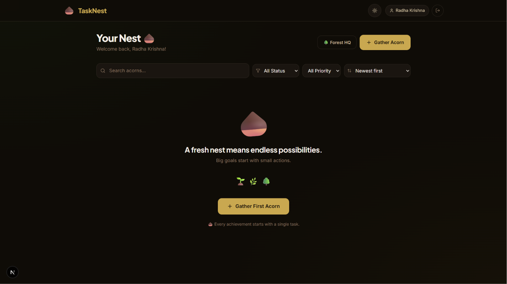
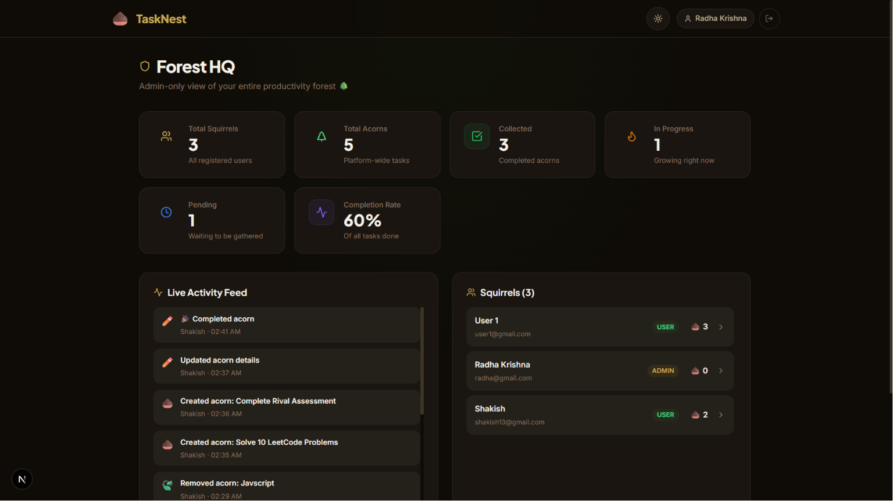

# 🌰 TaskNest

> *A forest grows one acorn at a time.*

TaskNest is a full-stack task management application built with Next.js 15, PostgreSQL, and Prisma. It features a unique forest-and-squirrel metaphor where tasks are "Acorns" and your workspace is your "Nest".

## 📸 Screenshots

| Sign In & Create Account |
|---|
|   |

| User Dashboard (Empty & Populated) |
|---|
|   |

| Task Creation & History |
|---|
|   |

| Admin Dashboard & User Details |
|---|
|   |

| Dark Mode (User & Admin) |
|---|
|   |

---

## ✨ Features

### For Users
- 🌱 **Create, Edit & Delete Tasks** — Full CRUD with title, description, priority, status, and due date
- 📎 **File Attachments** — Upload files (PDF, images, docs) directly to tasks; files appear inline on the task card
- 🔍 **Search & Filter** — Search tasks by name, filter by status and priority
- ↕️ **Sort Tasks** — Sort by created date, due date, or priority
- 📄 **Pagination** — 8 tasks per page with Prev/Next navigation
- 🕒 **Task History** — Click "History" on any task to view a full activity timeline
- 🔔 **Real-time Updates** — SSE-powered live updates so changes appear instantly
- 🌙 **Dark Mode** — Beautiful dark/light toggle with polished styling

### For Admins (Forest HQ)
- 🏰 **Platform Dashboard** — Total users, tasks, completion rate, live activity feed
- 👥 **User Management** — Click any user to navigate to their dedicated task view
- 🔒 **Read-Only User Views** — Admins can inspect any user's tasks without modifying them

---

## 🛠️ Tech Stack

| Layer | Technology |
|---|---|
| **Framework** | Next.js 15 (App Router) |
| **Language** | TypeScript |
| **Database** | PostgreSQL (via Docker) |
| **ORM** | Prisma 7 |
| **Auth** | NextAuth.js (JWT) |
| **Styling** | Tailwind CSS + Custom Design System |
| **Animations** | Framer Motion |
| **Icons** | Lucide React |
| **Real-time** | Server-Sent Events (SSE) |

---

## 🚀 Getting Started

### Prerequisites
- [Node.js 18+](https://nodejs.org/)
- [Docker Desktop](https://www.docker.com/products/docker-desktop/) (for PostgreSQL)
- [Git](https://git-scm.com/)

### 1. Clone the Repository

```bash
git clone https://github.com/CHSHAKISH/TaskNest.git
cd TaskNest/task-nest
```

### 2. Install Dependencies

```bash
npm install
```

### 3. Configure Environment Variables

Create a `.env` file in the `task-nest/` directory:

```env
DATABASE_URL="postgresql://<USERNAME>:<PASSWORD>@localhost:5432/<DATABASE_NAME>"
NEXTAUTH_SECRET="<generate-a-random-secure-string>"
NEXTAUTH_URL="http://localhost:3000"
```

### 4. Start PostgreSQL with Docker

From the **project root** (`TaskNest/`):

```bash
docker compose up -d
```

### 5. Run Database Migrations & Generate Client

```bash
npx prisma migrate deploy
npx prisma generate
```

### 6. Start the Development Server

```bash
npm run dev
```

Open [http://localhost:3000](http://localhost:3000) in your browser.

---

## 🌳 API Reference

### Authentication
| Method | Route | Description |
|---|---|---|
| `POST` | `/api/auth/register` | Register a new user |
| `POST` | `/api/auth/[...nextauth]` | Sign in / Sign out |

### Tasks
| Method | Route | Description |
|---|---|---|
| `GET` | `/api/tasks` | List tasks (with search, filter, sort, pagination) |
| `POST` | `/api/tasks` | Create a new task |
| `PATCH` | `/api/tasks/[id]` | Update a task |
| `DELETE` | `/api/tasks/[id]` | Delete a task |
| `GET` | `/api/tasks/[id]/history` | Get activity log for a specific task |

### Files
| Method | Route | Description |
|---|---|---|
| `POST` | `/api/upload` | Upload a file attachment to a task |

### Admin (ADMIN role required)
| Method | Route | Description |
|---|---|---|
| `GET` | `/api/admin/stats` | Get platform-wide statistics |

### Real-time
| Method | Route | Description |
|---|---|---|
| `GET` | `/api/sse` | Server-Sent Events stream for live task updates |

---

## 🗂️ Project Structure

```
task-nest/
├── app/
│   ├── api/                    # All backend API routes
│   │   ├── tasks/              # Task CRUD + history
│   │   ├── upload/             # File upload handler
│   │   ├── admin/stats/        # Admin analytics
│   │   └── sse/                # Real-time SSE endpoint
│   ├── admin/
│   │   ├── page.tsx            # Forest HQ dashboard
│   │   └── users/[id]/page.tsx # Per-user task view (admin only)
│   ├── nest/page.tsx           # Main user task dashboard
│   └── globals.css             # Design system & dark mode
├── components/
│   ├── layout/navbar.tsx       # Top navigation
│   └── tasks/
│       ├── task-card.tsx       # Task card with History/Edit/Delete
│       ├── task-form-modal.tsx # Create/Edit modal with file upload
│       └── task-history-modal.tsx # Activity timeline modal
├── lib/
│   ├── prisma.ts               # Prisma client singleton
│   ├── auth.ts                 # NextAuth configuration
│   ├── activity-logger.ts      # Activity log helper
│   └── hooks/use-sse.ts        # SSE React hook
└── prisma/
    └── schema.prisma           # Database schema
```

---

## 🔐 Default Roles

When you register via `/register`, users get the `USER` role by default.

To promote a user to `ADMIN`, use Prisma Studio:

```bash
npx prisma studio
```

Navigate to the `User` table and change the `role` field to `ADMIN`.

---

## 🐳 Docker Setup

The `docker-compose.yml` at the project root spins up:
- **PostgreSQL 15** on port `5432`
- **Adminer** (database browser) on port `8080`

```bash
# Start
docker compose up -d

# Stop
docker compose down

# Stop and remove all data
docker compose down -v
```

---

## 📸 Pages Overview

| Page | Route | Access |
|---|---|---|
| Landing | `/` | Public |
| Register | `/register` | Public |
| Login | `/login` | Public |
| Your Nest | `/nest` | Authenticated |
| Forest HQ | `/admin` | Admin only |
| User's Nest | `/admin/users/[id]` | Admin only |

---

## 🌿 Made with ❤️ by CH Shakish

*"Every great forest started as a single seed." — Oakley 🐿️*
